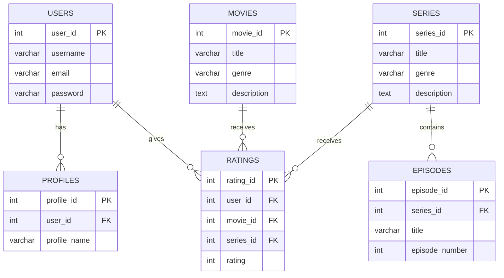
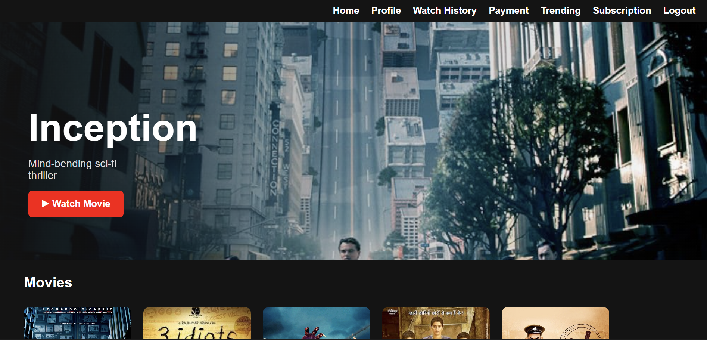
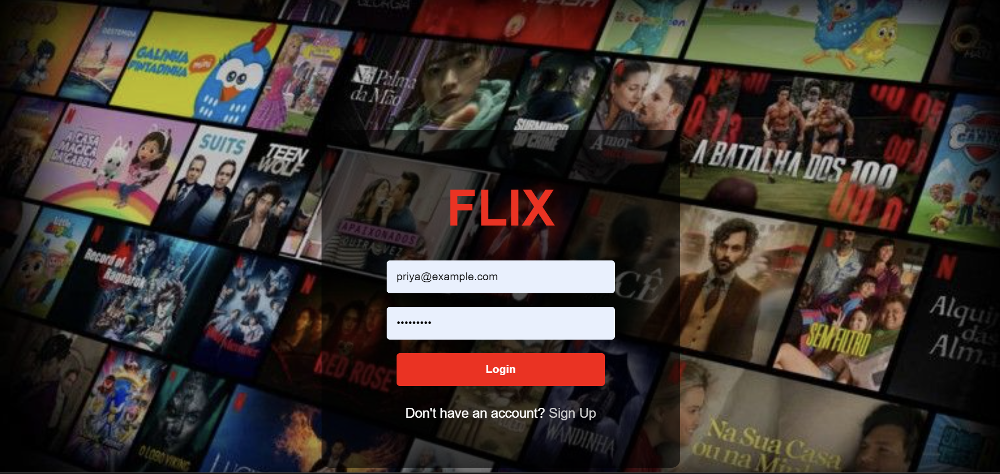
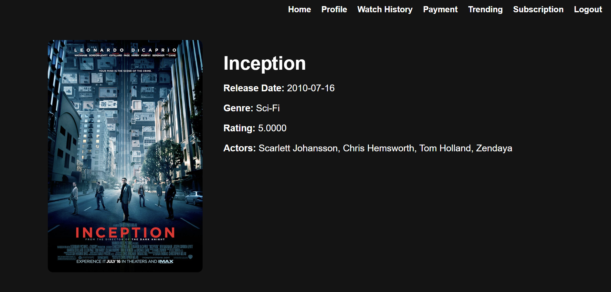
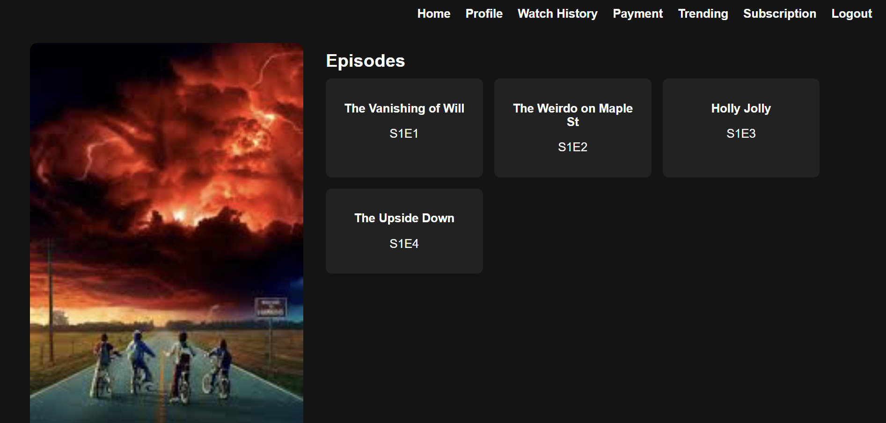

# 🎬 Flix – Netflix Clone

Flix is a Netflix-inspired streaming platform clone built with Flask (Python) and MySQL. It replicates the core UI/UX of Netflix: user authentication, profiles, trending banners, detailed movie/series pages, and card-based browsing. This project is designed for learning and showcasing skills in full-stack development (Flask + SQL + HTML/CSS).

---

## ⚙️ Installation

### 1. Clone the Repository
``` bash
git clone https://github.com/your-username/flix.git
cd flix
```

### 2. Create and activate a virtual environment
``` bash
python -m venv venv
venv\Scripts\activate   # On Windows
source venv/bin/activate   # On macOS/Linux
```

### 3. Install dependencies
``` bash
pip install -r requirements.txt
```

### 4. Set up MySQL Database
``` bash
CREATE DATABASE Flix;
```

### 5. Update your connection in app.py:
``` bash
conn = mysql.connector.connect(
    host="localhost",
    user="root",
    password="your_password",
    database="Flix"
)
```

### 6. Run the Flask app
``` bash
python app.py
```

### 7. Open in Browser
👉 http://127.0.0.1:5000/

# 🗄️ Database Schema (ERD)


# 🚀 Features

- **Authentication & Profiles**: Secure login & signup, multiple user profiles per account

- **Movies & Series Management**: Posters, descriptions, genres, actors, ratings, episodes

- **Trending Section**: Netflix-style hero banner & card grid

- **User Experience**: Dark theme, card-based UI, styled login/signup

# 🛠️ Tech Stack

- **Backend**: Flask (Python)

- **Frontend**: Jinja2 templates (HTML, CSS, Bootstrap-like styling)

- **Database**: MySQL

- **Connector**: mysql-connector-python

# 📂 Project Structure
``` txt
flix/
│── app.py                 # Main Flask application
│── requirements.txt        # Dependencies
│── README.md               # Documentation
│
├── templates/              # Jinja2 templates
│   ├── base.html
│   ├── home.html
│   ├── login.html
│   ├── signup.html
│   ├── profile.html
│   ├── trending.html
│   ├── movie_details.html
│   └── series_details.html
│
├── static/                 # Static assets
│   ├── style.css
│   ├── bg.jpg
│   └── posters/            # Movie/series posters
```

# 📦 Requirements
``` txt
Flask==3.0.3  
mysql-connector-python==9.0.0  
Werkzeug==3.0.3  
Jinja2==3.1.4  
itsdangerous==2.2.0  
click==8.1.7  
python-dotenv==1.0.1 
``` 
### Home Page


### Login Page


### Movie Details


### Series Details

```

# 👩‍💻 Author

**Shreya Rajesh Rathi**
College Student | E&TC  

---

# 📝 License
This project is open-source and available under the MIT License.
